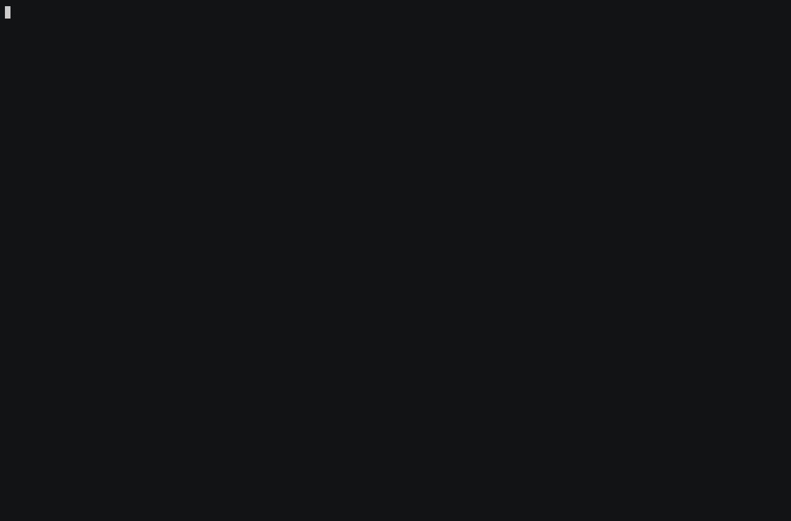

# thurbox-files

A file column for [thurbox](https://github.com/Thurbeen/thurbox) v2, and the two
tabs on the agent pane that make it useful: a file opens in an editor beside the
agent, and a changed file opens its diff there.



| Pane | Slot | What it draws |
|---|---|---|
| `plugins/90_files.lua` | `files` | A tree of the selected session's working directory, plus a Changes tab listing what git reports. Enter on a file emits `user.openfile` |
| `plugins/95_files_menu.lua` | `float` | The context menu a row opens |
| `plugins/20_agent.lua` | `center` | A fork of thurbox's bundled agent pane: the same terminal, with an **editor** tab that runs your editor on the emitted file and a **diff** tab for one path |

The three are one feature. The column emits, the agent pane consumes — installing
the column alone gives you a tree whose Enter key does nothing.

## Install

```bash
thurbox-cli plugin install git+https://github.com/spscream/thurbox-files --as plugins/90_files.lua
thurbox-cli plugin install git+https://github.com/spscream/thurbox-files --as plugins/95_files_menu.lua
thurbox-cli plugin install git+https://github.com/spscream/thurbox-files --as plugins/20_agent.lua
```

Three commands over one repository: the clone is shared, each `--as` names one
pane inside it and writes one `plugins.toml` entry. `thurbox-cli plugin check`
should then list `files` and `filemenu` beside the panes thurbox ships.

**The bundled agent pane has to go.** `20_agent.lua` here is a fork of it, so
both loading means two occupants of the `center` slot:

```bash
rm ~/.config/thurbox/ui/plugins/20_agent.lua
```

Deleting is how thurbox removes a file it wrote: it is recorded as removed and no
upgrade writes it again. Nothing is lost — the shipped copy is in the binary, and
`r` on it in settings → Interface puts it back (which is also how you undo all of
this).

## The column needs a line in `layout.lua`

The manager never writes your arrangement, so the `files` slot is yours to place.
In the horizontal row, after `center`:

```lua
-- The file column, LAST so it sits against the right edge with the agent
-- between it and the session list. Gated on `filled` so a slot no plugin can
-- fill does not reserve a rect for nothing.
if filled(ctx, "files") then
  columns[#columns + 1] = { slot = "files", pct = 22, min = 18 }
end
```

## Capabilities

Both are asked for per file, in settings → Interface, and the panes degrade
rather than break without them.

- `90_files.lua` — `run`, for the Changes tab. Untrusted, the tree still draws.
- `20_agent.lua` — `program` (the editor is a program this pane starts) and
  `run` (the diff it shows for one path).

A grant is keyed by the file's path, so installing these moves them out of
`plugins/` and the grant is asked for again the first time each pane wants it.

## Updating, and the fork

```bash
thurbox-cli plugin update            # every entry, to what its source carries now
thurbox-cli plugin sync              # bring the interface back in line with plugins.toml
```

The lock records the commit, not the branch. A dirty working copy is never moved:
if you edit a pane in place, `update` reports `kept` and leaves your edit alone —
which is also why nothing generated should be written inside
`~/.config/thurbox/ui/thurbox-files/`.

The agent pane is a fork, and its history says so: commit `43bf092` vendors
thurbox's `ui/plugins/20_agent.lua` exactly as shipped at **v2.22.4** (upstream
has not touched that file since v2.18.3), and the commit after it is the whole
fork — `+594 / -2`. When upstream changes the pane, that base commit is the merge
base, so taking the change is a git merge rather than a re-read of two 1500-line
files.

## Checks

Two jobs, both of which a pane can fail without anyone opening a terminal.

- **Lua** — `selene` against `thurbox.yml`, the plugin VM's real standard
  library, so a pane reaching for something the sandbox withholds is a lint
  failure rather than a nil three frames later; plus `stylua --check`.
- **Interface loads** — `ci/assemble-interface.sh` builds the directory a real
  install produces (thurbox's `ui/` as the base, this repository beside it, the
  bundled agent pane deleted, the `files` slot placed) and runs
  `thurbox-cli plugin check` against it. A pane that loads but that nothing
  places exits non-zero, which is the "empty column" failure caught early.

Both run against the release named by `THURBOX_TAG` in the workflow — the binary
and the `ui/` tree it loads have to be the same version. Locally:

```bash
git clone --depth 1 --branch v2.22.4 https://github.com/Thurbeen/thurbox .thurbox
cp .thurbox/thurbox.yml .          # what selene.toml's `std = "thurbox"` resolves to
selene plugins && stylua --check plugins
ci/assemble-interface.sh .thurbox build/ui
THURBOX_UI_DIR=$PWD/build/ui thurbox-cli plugin check
```

## The recording

`demo/record.sh` makes the GIF above. `demo/sandbox.sh` builds a throwaway
thurbox first — its own `HOME`, its own XDG roots, its own `TMUX_TMPDIR`, so it
cannot reach a real interface, a real database or a real tmux server — installs
these panes into it with the commands under [Install](#install), and leaves a
small git repository for the tree to show.

Every key in the GIF is a key: the recording runs inside tmux, which sends F3 and
F6 the way a keyboard does, and the two capability grants are pressed in
settings → Interface rather than written into `ui.json`. That is also why VHS is
not used here — it drives a headless browser, which has no F-keys to send, and
both doors into this feature are F-keys. `asciinema` records the pty and `agg`
rasterises the cast.

```bash
demo/record.sh [media/demo.gif]   # needs asciinema, agg, tmux, git, sqlite3, nvim
SNAP=/tmp/steps demo/record.sh    # plus what the screen held at each step
```

## Licence

MIT. `plugins/20_agent.lua` derives from thurbox's bundled pane, also MIT,
copyright Thurbeen.
